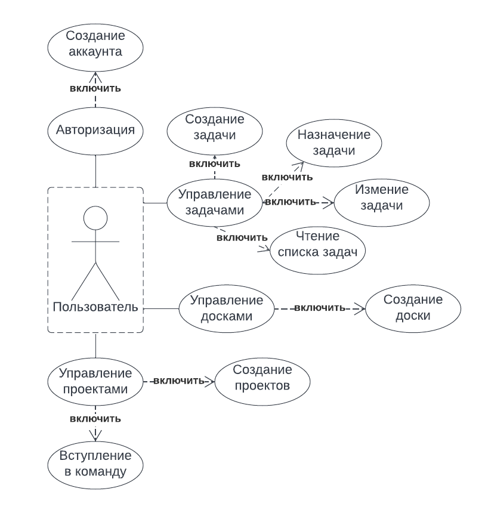
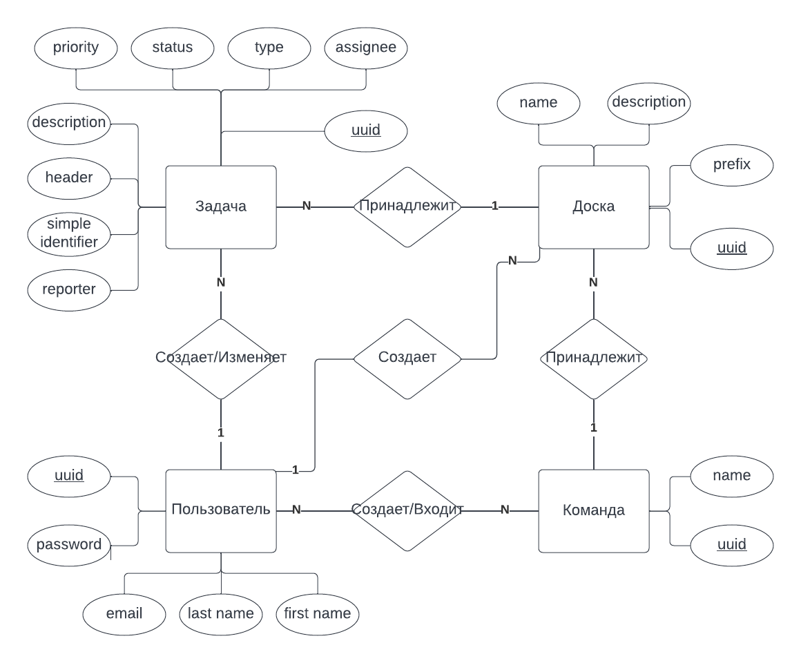
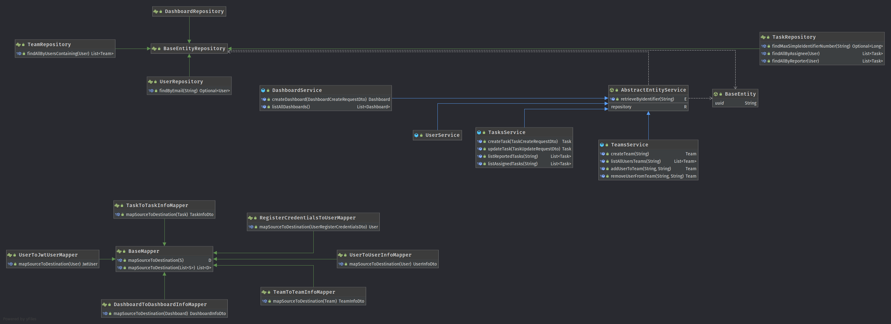
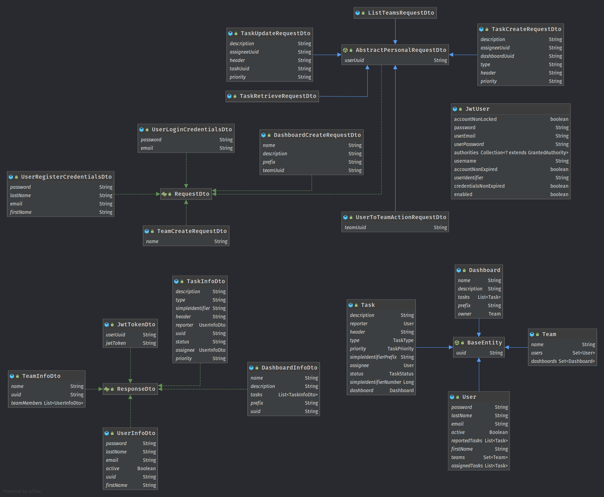

# FLOWrence

## About
**FLOWrence** is a light-weight task management engine for Agile-driven projects & teams distributed as a rest-service application and named after a city in Central Italy. Users may create and assemble teams, create dashboards and track tasks. 

### Domain
The domain of the project consists of: Users - people which uses the application, Teams - a group of people united by a common goal or area of responsibility, Tasks - certain tasks reported & assigned by Users, Dashboards - combinations/pools of Tasks for certain Team.

### Comparison with other projects
The closest existing popular projects/products present on the market are: Atlassian's Jira & Trello, Jean-Philippe's Redmine and Nulab's Backlog. The table below displays a short comparing overview of these projects to FLOWrence.  
#### Criteria descriptions
1. Open Source - project have an open source code and available for forking, modification and free commercial usage.
2. Client-integrable - the client part of the project, as well as API, are modifiable and available for integration with any client: web, IOS/Android, desktop apps.
3. Light-weigh - the project is simple to use out of box without any specific users training.
#### Comparison table
| Criteria/Project | FLOWrence | Jira | Trello | Redmine | Backlog |
| ---------------- | --------- | ---- | ------ | ------- | ------- |
| Open Source | Yes | No | Trello | Yes | No |
| Client-integrable | Yes | No | No | Partially | No |
| Light-weigh | Yes | No | Yes | Partially | Yes |

## Why FLOWrence
**FLOWrence** is designed to be a kind of "breath of fresh air" in project management and provide enthusiasts, Start-ups and brave enterprise companies a well-designed and freely customizable tool for tasks tracking and managing projects in a as flexible as possible way.

## Internal design
### Diagrams (RU)
**Use-Case diagram** 

**Entity-Relation diagram** 

### Technologies & Stack
FLOWrence core is running Java (11+) and is compatible (tested) with Hotspot JVM by Oracle and GraalVM.

#### Complete technologies list:
1. Core:
    1. **Java**, version 11 or higher
    2. **Spring Boot** _(Web, Security)_, currently 2.6.6 (see Spring's vulnerabilities list)
    3. **Hibernate & JPA** _(w/ Spring Data)_, for actual versions - see `build.gradle`
    4. **Cache**, _L2 cache (e.g. via Apache Ignite) to be implemented_
    5. Misc: 
        1. Mapstruct
        2. MySQL & Postgres, any other connectors
        3. Lombok
        4. JUnit (Jupiter)
        5. Logback
        6. JsonSchema2Pojo, _to be implemented_
2. Build tools
    1. **Gradle** _(w\ gradlew)_
3. Database - RDBMS (abstract and ddl-generated)
    1. **MySQL** (MariaDB)
    2. **PostgreSQL**
    3. **Oracle**
4. API
    1. **Postman collection** for API testing
5. Containerization/deployment
    1. **Docker** or **K8s/OpenShift**, _to be implemented (as well as Fat-Jar)_

#### Notes
1. Authentication's based on JWT tokens  
2. ...

### Technical documentation
The project domain architecture's represented as 4 separate components with 3 layers:
1. Authorization component - responsible for handling the incoming requests with authentication
2. Controller component/layer - handles the incoming requests of user actions
3. Service component/layer - operates with data and performs business-logic
4. Repository component/layer - responsible for database interactions and data manipulations in storage

#### Generated UML diagrams
**Service-Repository layers**

[Service-Repository layers UML](./meta/diagrams/uml/Service-Repository.uml)

**RDBMS Entities and DTOs**

[RDBMS Entities and DTOs UML](./meta/diagrams/uml/Entity-Dto.uml)
